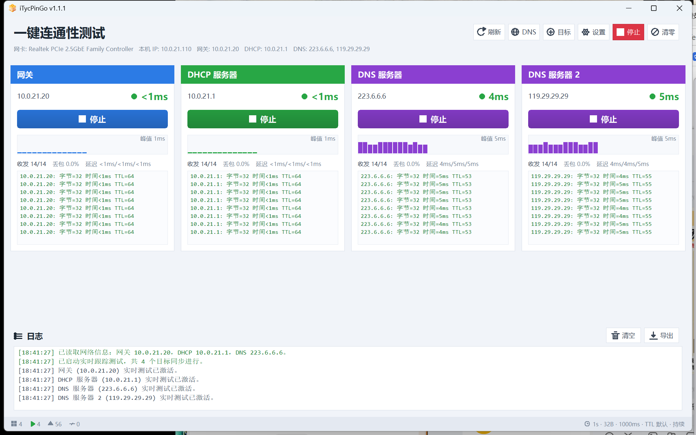

# iTycPinGo

**一键连通性测试**

单文件 227 KB · 免安装 · 无运行库依赖 · Windows 10/11 64 位

### [⬇ 下载最新版](https://github.com/tyrantcwj/iTyc-PinGO/releases/latest)

---

自动读取本机**网关 / DHCP 服务器 / DNS 服务器**并生成测试卡片，一键对全部目标**同步 ping**，
实时显示延迟、丢包与走势。排查「到底是本地网络的问题还是外网的问题」时，一眼就能看出来。

## 功能

- **自动读取本机网络信息** —— 网关、DHCP 服务器、DNS 服务器（可能多个）自动变成测试卡片，
  不用手敲 IP。
- **一键添加公共 DNS** —— 阿里（223.5.5.5 / 223.6.6.6）、腾讯（119.29.29.29 / 182.254.116.116）、
  谷歌（8.8.8.8 / 8.8.4.4）。可单个加，也可一键全加，和本机 DNS 放一起横向对比。
- **多目标同步测试** —— 「全部开始」让所有卡片同时跑，谁慢谁丢包一目了然。
- **实时指标** —— 当前延迟、发送/接收/丢包率、最小/平均/最大延迟，外加一条延迟走势图
  （超阈值标黄，丢包标红）。
- **参数可调** —— 测试频率（间隔秒数）、数据包大小、超时、TTL、不分片、IPv4/IPv6、
  测试次数（0 = 一直测）、高延迟告警阈值、结果保留行数。
- **自定义目标** —— 任意 IP 或域名，随时添加删除。
- **完整记录导出** —— 每一次 ping 都留档，可导出为 CSV：`时间,目标,主机,结果,延迟ms,TTL,字节`，
  毫秒级时间戳、跨目标按时间归并成一条时间线，尾部附各目标统计与运行日志。Excel 直接打开不乱码。
- **实时日志** —— 关键事件带时间戳，可清空。
- **配置自动保存** —— 参数和手动添加的目标下次启动自动恢复。
- **高分屏适配** —— 跟随系统缩放，4K 屏上不糊。

## 使用

下载 [`iTycPinGo.exe`](https://github.com/tyrantcwj/iTyc-PinGO/releases/latest) 双击运行即可，
无需安装、无需 .NET / VC++ 运行库。

配置文件存放在 `%APPDATA%\iTycPinGo\config.ini`，卸载时删掉这个目录即可清理干净。

## 性能

3840×2160、150% 缩放实测：

| | |
|---|---|
| exe 体积 | 227 KB |
| 冷启动到窗口出现 | 0.10 s |
| 内存 · 工作集 / 专用字节 | 18.7 MB / 4.5 MB |
| 拖动窗口 | 约 74 FPS |
| 运行时依赖 | 无 |

## 说明

- 只支持 Windows。
- 延迟精度为整毫秒，小于 1 毫秒显示为 `<1ms`，与 Windows 自带 ping 一致。
- 部分设备默认不响应 ICMP，超时不一定代表网络不通。
- 目标数量上限 32 个。

## 更新日志

见 [Releases](https://github.com/tyrantcwj/iTyc-PinGO/releases)。

## 版权

版权所有 © 2026 tyrantcwj，保留所有权利。

本软件仅以编译后的可执行文件形式发布，源码不公开。
